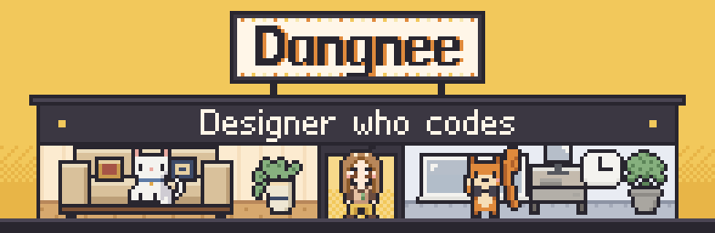
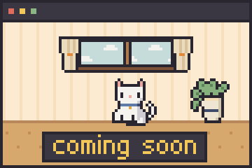
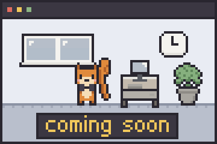

  

<h3>Questions? &emsp;&emsp;&emsp;Quests!</h3>

모르는 것을 그냥 지나치는 재주가 없습니다. 
AI와 질문을 주고받으며 생각의 끝을 자주 확인합니다. 
그리고 그 끝에서 발견한 것을 기획하고, 만들고, 배포합니다.

 

<table>
  <tr>
    <td width="50%">
      
    </td>
    <td width="50%" valign="bottom">
      <h3>Pixel House</h3>
      
작은 집을 하나 지었습니다. 픽셀로.

      
<code>곧 공개</code>

    </td>
  </tr>
  <tr>
    <td width="50%" align="right" valign="top">
      <h3>Pixel Office</h3>
      
이번에는 사무실입니다. 출근하는 친구들도 있습니다.

      
<code>곧 공개</code>

    </td>
    <td width="50%">
      
    </td>
  </tr>
</table>

<h3>More Works</h3>

그 밖에도 이것저것 만들었습니다.

<ul>
  <li><b>inmyin</b> — 가진 물건을 사진으로 찍어 가상 인벤토리에 진열하는 웹앱</li>
  <li><b>welcome</b> — 콘텐츠와 초대장을 만들고, 방명록을 받는 모바일 우리집</li>
  <li><b>icon-preview</b> — 앱 아이콘을 iPhone 홈 화면에 놓아 보는 미리보기 도구</li>
</ul>

 

  <a href="mailto:dangnuie@gmail.com">Email</a>

